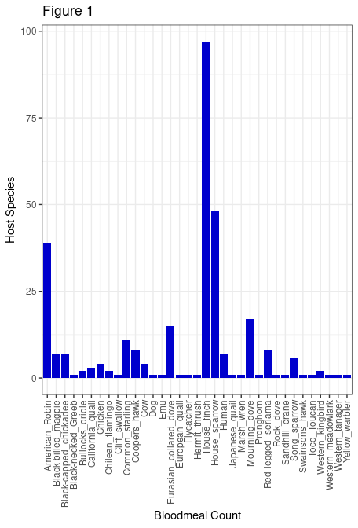
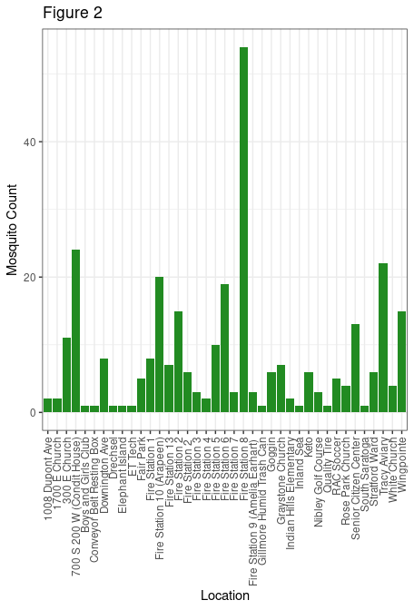
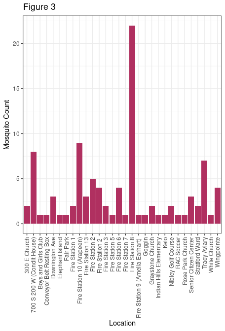

Warm-up mini-Report: Mosquito Blood Hosts in Salt Lake City, Utah
================
Whitney Crook
2025-10-10

- [ABSTRACT](#abstract)
- [BACKGROUND](#background)
- [STUDY QUESTION and HYPOTHESIS](#study-question-and-hypothesis)
  - [Question](#question)
  - [Hypothesis](#hypothesis)
  - [Prediction](#prediction)
- [METHODS](#methods)
  - [Procedure](#procedure)
  - [Prevalence of House Finches for Mosquito
    Bloodmeal](#prevalence-of-house-finches-for-mosquito-bloodmeal)
  - [House Finch Bloodmeal Location](#house-finch-bloodmeal-location)
- [DISCUSSION](#discussion)
  - [Interpretation - Figure 1 (Prevalence of house
    finches)](#interpretation---figure-1-prevalence-of-house-finches)
  - [Interpretation - Figures 2&3
    (Locations)](#interpretation---figures-23-locations)
- [CONCLUSION](#conclusion)
- [REFERENCES](#references)

# ABSTRACT

This report investigates which of the mosquito bloodmeal host species in
the Salt Lake area is most common to predict which areas are most likely
to have a more cases of West Nile virus. We hypothesized that house
finches would be the most common and the data supports that hypothesis.
I created three bar plots to support our hypothesis. In different ways,
each of them are eviedence that house finches are the most common host
for mosquito bloodmeals. Because of that, we can conclude that house
finches could play a significant role in the spread of West Nile virus.

# BACKGROUND

West Nile virus (WNV) is a disease that is spread through bites from
infected mosquitoes. Often WNV goes undetected because symptoms rarely
are shown. Occasionally though the virus can be severe enough to cause
death (Cleaveland Clinic, 2025). Detectable West Nile virus has become
more prevalent in 2025 than in previous years (CDC, 2025).

WNV is often carried by animals that have been bitten by an infected
mosquito and can be passed to others if the infected mosquito bites
again. One of the most common hosts for WNV is birds which are the focus
of our study.

We have collected mosquitoes from traps around Salt Lake to study the
spread of the virus further. Using mosquitoes that have recently had a
bloodmeal, we were able to extract DNA sequences from the blood to
identify what type of animal the mosquito bit for that bloodmeal. We had
to run a PCR and sequence the DNA to find the results for what the
bitten animal was. There was a wide variety of animals with birds being
the most common.

The purpose of our study is to show the key role house finches play in
the spread of the virus. Using a viremia duration (Kumar et al., 2003)
bar plot, we can see that house finches are typically have the longest
window for detectable viremia which provides the foundation for our
hypothesis that house finches are the most common host involved in the
spread of West Nile virus. It also provides some evidence for our
prediction that, if house finches are the main cause of the spread of
WNV, then areas in Salt Lake City with higher numbers of house finches
will also have more confirmed cases of WNV in the mosquitoes caught in
that area.

``` r
# Manually transcribe duration (mean, lo, hi) from the last table column
duration <- data.frame(
  Bird = c("Canada Goose","Mallard", 
           "American Kestrel","Northern Bobwhite",
           "Japanese Quail","Ring-necked Pheasant",
           "American Coot","Killdeer",
           "Ring-billed Gull","Mourning Dove",
           "Rock Dove","Monk Parakeet",
           "Budgerigar","Great Horned Owl",
           "Northern Flicker","Blue Jay",
           "Black-billed Magpie","American Crow",
           "Fish Crow","American Robin",
           "European Starling","Red-winged Blackbird",
           "Common Grackle","House Finch","House Sparrow"),
  mean = c(4.0,4.0,4.5,4.0,1.3,3.7,4.0,4.5,5.5,3.7,3.2,2.7,1.7,6.0,4.0,
           4.0,5.0,3.8,5.0,4.5,3.2,3.0,3.3,6.0,4.5),
  lo   = c(3,4,4,3,0,3,4,4,4,3,3,1,0,6,3,
           3,5,3,4,4,3,3,3,5,2),
  hi   = c(5,4,5,5,4,4,4,5,7,4,4,4,4,6,5,
           5,5,5,7,5,4,3,4,7,6)
)

# Choose some colors
cols <- c(rainbow(30)[c(10:29,1:5)])  # rainbow colors

# horizontal barplot
par(mar=c(5,12,2,2))  # wider left margin for names
bp <- barplot(duration$mean, horiz=TRUE, names.arg=duration$Bird,
              las=1, col=cols, xlab="Days of detectable viremia", xlim=c(0,7))

# add error bars
arrows(duration$lo, bp, duration$hi, bp,
       angle=90, code=3, length=0.05, col="black", xpd=TRUE)
```


# STUDY QUESTION and HYPOTHESIS

## Question

In Salt Lake, what species of bird is the main host for spreading WNV?

## Hypothesis

House finches are the most common host for the spread of WNV in Salt
Lake City.

## Prediction

If house finches are the main cause of the spread of WNV, we predict
that areas in Salt Lake City with higher numbers of house finches will
also have more confirmed cases of WNV in the mosquitoes caught in that
area.

# METHODS

### Procedure

To analyze the data we collected, I created a bar graph showing how many
bloodmeals were collected from each species that was identified using
the DNA sequences. This shows which of the WNV host is the most common.

I created two other bar graphs. The first one shows the distribution of
mosquitoes collected across all of the trap in Salt Lake. In this graph,
all of the host species are counted. The second bar graph is similar but
narrowed down to showing only the locations where a bloodmeal came from
a house finch. This shows where house finch bloodmeals were the most
common among the Salt Lake trap locations.

To create all three bar graphs, I used the ggplot2 package. This package
makes it easier to create more detailed graphs than with the basic
plot() function in R. The bar graphs were easier to make legible and I
was able to add details, such as the full name of the species/locations
on the x axis, that the basic plot() function does not allow.

## Prevalence of House Finches for Mosquito Bloodmeal

``` r
install.packages("ggplot2")
```

    ## Installing package into '/cloud/lib/x86_64-pc-linux-gnu-library/4.5'
    ## (as 'lib' is unspecified)

``` r
library("ggplot2")
#for better looking graphs

bloodmeal <- read.csv("bloodmeal_for_BIOL3070 (1).csv")
# this dataset includes the species name, DNA sequence for various samples, 
#and the location the mosquito was caught at

##Figure 1
ggplot(bloodmeal, aes(x = bloodmeal$host_common)) +
  geom_bar(fill = "blue3") +
  theme_bw() +
  labs(x = "Bloodmeal Count",
       y = "Host Species",
       title = "Figure 1") +
  theme(axis.text.x = element_text(angle = 90, vjust = 0.5, hjust = 1))
```



``` r
sum(bloodmeal$host_common == "House_finch")
```

    ## [1] 97

``` r
# there are 97 hosts that are house finches

sum(bloodmeal$host_common == "House_sparrow")
```

    ## [1] 48

``` r
# there are 48 hosts that are house sparrows
```

## House Finch Bloodmeal Location

``` r
house_finch <- bloodmeal[bloodmeal$host_common == "House_finch",]

##Figure 2
ggplot(bloodmeal, aes(x = bloodmeal$Location)) +
  geom_bar(fill = "forestgreen") +
  theme_bw() +
  labs(x = "Location",
       y = "Mosquito Count",
       title = "Figure 2") +
  theme(axis.text.x = element_text(angle = 90, vjust = 0.5, hjust = 1))
```



``` r
#this creates a barplot showing how many mosquitoes were collected in each 
#of the locations with traps

##Figure 3
ggplot(house_finch, aes(x = house_finch$Location)) +
  geom_bar(fill = "maroon") +
  theme_bw() +
  labs(x = "Location",
       y = "Mosquito Count",
       title = "Figure 3") +
  theme(axis.text.x = element_text(angle = 90, vjust = 0.5, hjust = 1))
```



``` r
#this plot shows the distribution of locations for mosquitoes with a blood meal
#from house finches
```

# DISCUSSION

## Interpretation - Figure 1 (Prevalence of house finches)

Fig. 1 shows the variety of bird that mosquitoes used for bloodmeals. As
we hypothesized, the house finches were the most common host species.
House finch bloodmeal numbers were up to 97 which is significantly
higher than any other species. The next most common species was the
house sparrow which only was counted 48 times.

## Interpretation - Figures 2&3 (Locations)

Fig. 2 shows that the most common location for all of the counted
mosquitoes with a bloodmeal was at the Fire Station 8 trap. Similarly,
fig. 3 also shows Fire Station 8 to be the most common location but this
graph is only showing counts for mosquitoes with a bloodmeal from a
house finch. This supports our hypothesis because the distributions on
both graphs are similar. That similarity is evidence that house finches
are the most common bloodmeal hosts because the house finch counts are
what is driving the shape of the data.

# CONCLUSION

In conclusion, we hypothesized that house finches would be the most
common host for spreading WNV in the Salt Lake area and our data
supports that hypothesis. Based on that, house finches do seem to be
related to the spread of WNV. A limitation to this analysis is that,
based on the data we have, we cannot tell which of the house finch
bloodmeals were positive for West Nile virus but there is a higher
number of WNV cases in the Salt Lake area (CDC, 2025) so it can be
assumed that there are house finches in that area carrying the virus.

Moving forward, a next step could be connecting this data with the
frequency of WNV cases within a certain area around each trap we have
collected mosquitoes from. This would give a better idea of how much
house finches are contributing to the spread of the virus to provide
more evidence to support our prediction that there would be more cases
of WNV in areas with more house finches.

# REFERENCES

1.  Komar N, Langevin S, Hinten S, Nemeth N, Edwards E, Hettler D, Davis
    B, Bowen R, Bunning M. Experimental infection of North American
    birds with the New York 1999 strain of West Nile virus. Emerg Infect
    Dis. 2003 Mar;9(3):311-22. <https://doi.org/10.3201/eid0903.020628>

2.  “Current Year Data (2025).” Centers for Disease Control and
    Prevention, Centers for Disease Control and Prevention, 7 Oct. 2025,
    www.cdc.gov/west-nile-virus/data-maps/current-year-data.html.

3.  “West Nile Virus.” Cleveland Clinic, 12 Sept. 2025,
    my.clevelandclinic.org/health/diseases/10939-west-nile-virus.

4.  ChatGPT. OpenAI, version Jan 2025. Used as a reference for functions
    such as ggplot() and troubleshooting error messages. Accessed
    2025-10-10.
